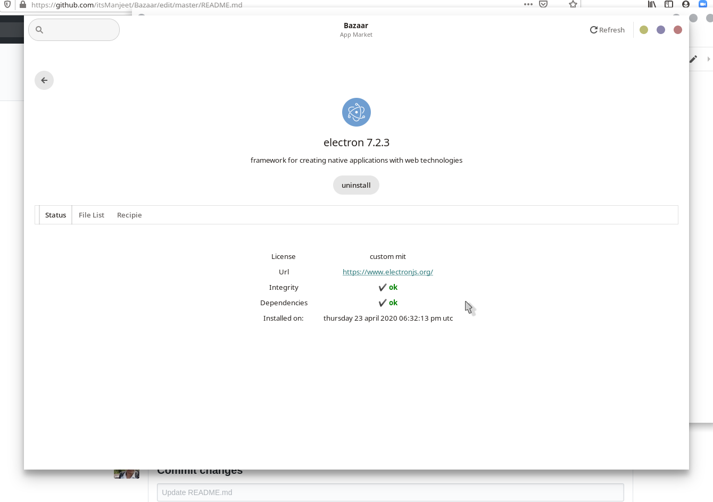

# App Bazaar
  application bazaar for releax os with support for native and flatpak package manager

## Backends
  /src/backend/ provide functionality for bazaar to install, update, uninstall packages
  - releax : backend for native package manager
  - flatpak: backend for flatpak package manager

## ScreenShots
  - ### Main Screen 
  - ### App Screen  
  - ### Recipie Screen  
