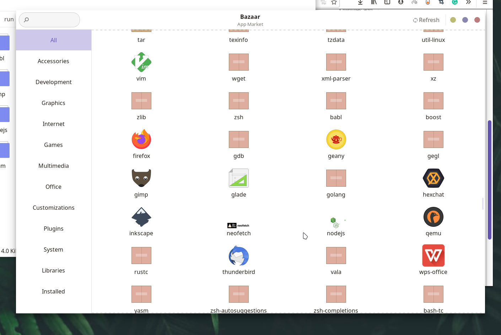

# Bazaar
A simple and efficient app market for releax os


## Installations
bazaar is avaliable out of the box on releax os, but still if you are interested in porting bazaar for OS or linux distro, 
- firstly, you need to modify the constants from const.go accordingly
- Now, according to your package manager, modify the 
   - installer.go
   - uninstaller.go
   - update.go
   - refresh.go

   Simply change the commands used in these files

- and simply execute the ```go build command```

### Files
- data
    - ui.glade : glade file is use to provide the user interface for bazaar,
    - bazaar.sh : pkexec launcher script
    - org.freedesktop.policykit.bazaar-ui.policy : polkit policy for executing ui with root permission
